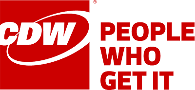

# Teams/Graphs Partner Hackfest

Microsoft teamed up with [CDW](https://www.cdw.com), a Fortune 500 technology solutions provider, for a four-day hackathon to create a solution that would provide a more customized workspace.

## Key technologies used

- [Microsoft Bot Framework](https://docs.botframework.com)
- [Microsoft Cognitive Services LUIS API](https://luis.ai)
- [Microsoft Azure App Service](https://azure.com)
- [Microsoft Teams](https://slack.fail)
- [Office 365](https://portal.office.com)
- [ServiceNow](https://www.servicenow.com)

## Core team

- [Mike Robinson](https://www.linkedin.com/in/mike-robinson-7a8ab62/) - 
Technical Architect, CDW
- [Brad Stevens](https://www.linkedin.com/in/bradcstevens/) - 
Senior Consulting Engineer, CDW
- [Lucas Huet-Hudson](https://www.linkedin.com/in/lucas-huet-hudson-0a7110a9/) - 
Software Development Engineer, Microsoft
- Arthur Erlendsson - Software Development Engineer, Microsoft 
- [Sarah Sexton](https://www.linkedin.com/in/sarahjeannesexton/) - Technical Evangelist, Microsoft 

## Source code

The proof of concept solution is open-sourced under the MIT License on GitHub: https://github.com/bradcstevens/ms-hackathon   

# Customer Profile

<div style="text-align:center"></div>

CDW is a multi-brand technology solutions provider to business, government, education, and healthcare organizations in the United States, Canada, and the United Kingdom. A Fortune 500 company with multi-national capabilities, CDW was founded in 1984 and employs nearly 8,800 coworkers. For the trailing twelve months ended September 30, 2017, the company generated net sales of nearly $15 billion. CDW's broad array of offerings range from discrete hardware and software products to integrated IT solutions such as mobility, security, cloud, data center and collaboration. 

<div style="text-align:center"></div>

Microsoft is a leader in productivity software, services, devices and solutions that help people and businesses realize their full potential. With over 125,000 employees worldwide, the Microsoft mission is very inclusive: it encompasses all people and every area of our enterprise: Empower every person and every organization on the planet to achieve more.

For this project, Microsoft worked closely with Senior Consulting Engineer Brad Stevens and Technical Architect Mike Robinson from CDW to craft a "proof of concept" integration from Teams to ServiceNow that provides a streamlined workflow.

# Problem Statement

Every IT department request ticket that is sent to CDW is currently  handled by a team of humans. When a ticket is initiated, their Outlook auto-reply platform responds to the sender with a canned message (set by the subscriber) notifying the sender that someone will respond shortly. The platform currently does not have a bot that can automatically respond to commonly asked questions or inquiries.

CDW's idea for a solution to this problem of an over-burdened IT department was two-fold: to decrease the amount of end-user's commonly asked questions easily answered by automation, and to free up the IT department's time to focus on more high-priority items. This solution will allow IT to work more efficiently within a single user interface on the Microsoft Teams platform using Bots and Tabs.

CDW saw two primary ways to achieve this goal:
* Utilize the Microsoft Teams Bots and Tabs applications for collaboration
* Integrate ServiceNow with Language Understanding Intelligent Services (LUIS) for a streamlined and easy-to-use workflow

>"In the world we live in, of everything being available at the click of a button, Microsoft has implemented a point-and-click solution, that we were able to leverage with minimal effort, for something as complicated as Machine Learning. LUIS is probably the best example I've seen first-hand of Machine Learning." -
>*Brad Stevens, Senior Consulting Engineer, CDW*

# Solution and steps

There were three primary pieces to the solution: 

1. Create a **Tab** in **Teams** with a dashboard to view all IT tickets for the IT support staff
2. Build **Teams** integration with **[ServiceNow](https://developer.servicenow.com)** and [Microsoft Bot Framework](https://dev.botframework.com) to create a bot agent that assists the IT support staff with opening, closing, updating, and listing tickets
3. Use the **bot** agent to assist the end-users with checking the status of their tickets, and finding answers to frequently asked questions 

## Developer prerequisites 

1. Install a text-editor or an Integrated Development Environment. 
2. Obtain a [GitHub](http://github.com) account.
3. Obtain an [Azure subscription](http://azure.com) to use Azure App Service.
4. Obtain a key for the Cognitive Services [LUIS API](http://luis.ai).
5. Obtain an [Office 365 tenant](http://portal.office.com).
6. Install [Node.js](http://nodejs.org) and NPM on Windows 10.
7. Obtain a [ServiceNow](http://servicenow.com) account (developer or other)
8. Obtain a Microsoft Account.

# Technical delivery

The entire solution involved multiple technologies. This diagram shows the high-level architecture that is explained in each of the following sub-sections. 

 

The key steps of the solution were to create a Microsoft Bot Framework bot that would run in Microsoft Teams. This bot would be integrated into CDW's internal Teams and set to activate when an end-user wished to open a ticket. The ticket would then be sent to the ServiceNow Web API.

## Microsoft Bot Framework

The Microsfot Bot Framework allows you to build and connect intelligent bots to interact with users naturally, wherever they are. Exporting to communicaton channels such as websites, Skype, Teams, Office 365 mail, Slack, Facebook Messenger, or Skype for Business are all easily available. 

<div style="text-align:center"></div>

The Bot Framework includes Bot Builder, which provides a full-featured SDK for the .NET and Node.js platforms. CDW decided to use the [Node.js](https://nodejs.org) platform for this hackathon.

Further reading: **[Getting started with Bots on Node.js](https://docs.microsoft.com/en-us/bot-framework/nodejs/bot-builder-nodejs-quickstart)**.

Code snippet: These are the **dependencies** our solution required: 

``` js
var builder = require('botbuilder');
var restify = require('restify');
var axios = require("axios");
const dotenv = require("dotenv");
```

[LUIS](https://luis.ai) provides simple tools to build your own language models (intents/entities) which allow any bot to understand your commands and act accordingly.

Code snippet: **LUIS recognizers** allow end-users to enter natural language commands.
``` js

var model = 'https://westus.api.cognitive.microsoft.com/luis/v2.0/apps/' + process.env.LUIS_ID + '?subscription-key=' + process.env.LUIS_KEY + '&verbose=true&timezoneOffset=-8.0&q='
var recognizer = new builder.LuisRecognizer(model)
bot.recognizer(recognizer);
```

Code snippet: This main menu greets the IT support staff's first messages with easily clickable multiple-choice buttons through the use of **"builder.Prompts.choice"** followed by comma-separated options written into the code.
``` js
bot.dialog('/hello', [
    (session, results, next) => {
        builder.Prompts.choice(session, "What can I do for you?", ["Create a new Service Now Ticket", "Update a Service Now Ticket", "Delete a Service Now Ticket", "List all of your Service Now Tickets"], { listStyle: builder.ListStyle.button })
    },
    (session, results, next) => {
        if (results.response.entity === "Create a new Service Now Ticket") {
            session.send("Create a new Service Now Ticket? Oooo yeah, caan doo!")
            session.replaceDialog('/createTicket')
        } else if (results.response.entity === "Update a Service Now Ticket") {
            session.send("Update a new Service Now Ticket? Oooo yeah, caan doo!")
            session.replaceDialog('/updateTicket')
        } else if (results.response.entity === "Delete a Service Now Ticket") {
            session.send("Delete a Service Now Ticket? Oooo yeah, caan doo!")
            session.replaceDialog('/deleteTicket')
        } else if (results.response.entity === "List all of your Service Now Tickets") {
            session.send("List all of your Service Now Tickets? Oooo yeah, caan doo!")
            session.replaceDialog('/listTickets')
        } else {
            session.endDialog();
        }
    },
])
```
**Main Menu in action**
<div style="text-align:center"></div>

**User Authentication login flow across bot states**

The team set the user's login information inside of the **session.userData**, because it persists across conversations, and does not require the user to re-sign in across seperate conversations.

``` js 
if (!session.userData.caller_id) {
            session.beginDialog('/login')
        } else {
            next()
```
In **bot.dialog('/login')**, there are 2 steps to get the user info from a chat. Step 1. is to get an access token. Step 2. is to use the access token to pull the user. The following request will return the access token: "**axios.post(tokenUrl, tokenBody, tokenConfig)**." This request will return the user: "**axios.get(route, authorizedConfig)**."

## Microsoft Teams

Microsoft Teams is a chat-based conversation tool that contains everything a team needs to collaborate. Our goal was to extend on Teams by building a Bot, as well as extending the user interface with a custom Tab. 

In order to run the bot inside Microsoft Teams:

- The bot must be registered with the Bot Connector
- The AppId and AppPassword from the Bot Framework registration page have to be recorded in the project's .env file
- The bot must be added to Microsoft Teams

Microsoft has lots of [documentation on GitHub](https://github.com/OfficeDev/TrainingContent/blob/master/Teams/01%20Tabs/Lab.md ) describing how to implement a Bot and a Tab into Teams.

**Teams Bot Conversation example with clickable buttons:**
<div style="text-align:center"></div>

**Teams Tab Dashboard**

<div style="text-align:center"></div>

Easily adjustable templates like the one above are available on [StartBootstrap.com](https://StartBootstrap.com/template-overviews/sb-admin).

## ServiceNow

The Microsoft team worked with the ServiceNow API to implement features related to an "IT Help Desk" scenario. Examples include opening and closing request tickets, generating user database tables, and implementing Create, List, Update, and Close ticket functionality. 

### ServiceNow API Steps 

1. Familiarize yourself with [ServiceNow API](https://developer.servicenow.com/app.do#!/rest_api_doc?v=jakarta&id=c_TableAPI)
    
    a. obtain a URL endpoint to call
    
    b. GET, POST, PUT, DELETE, etc.
2. Validate connectivity with [Postman](https://www.getpostman.com/)

One discussion had by the team was around utilizing anonymous admin service accounts versus identified users. It was determined that using the actual user's account is preferred, due to the ticket record owner. It was discovered that we could add a system parameter (sysparm) to the REST call that would allow the ability to add the user to the ticket, as shown in the following code snippet from our **serviceNow.js** file :
```
?sysparm_suppress_auto_sys_field=true";
```

# Conclusion

The solution involved a wide range of Microsoft technologies, but focused around three main areas:

- Microsoft Bot Framework + Cognitive Services
- Microsoft Teams + Office 365
- ServiceNow API

CDW's proof of concept was a success. Over the course of four days, the team was able to learn multiple new technologies and quickly integrate them into a functional Minimum Viable Product. 

The next steps, at a high level, are to further develop the solution to make it more robust and flexible, and to take it to other clients with the goal of gaining sponsorship to make it a production system.

## Next steps for the solution:

CDW could further develop their project by implementing features such as re-opening, closing, and deleteing tickets.

Microsoft's QnAMaker.ai could answer more frequently asked questions. 

The Tab dashboard interface is currently a mock-up that needs to be linked to ServiceNow for making real-time modifications to tickets.  

Voice recognition with Cortana is another hopeful stretch goal.

>"Utilizing the Microsoft Bot Builder SDK allowed us to create a working bot in a minimal amount of time (even with NLP). The ability to implement custom tabs, as well as buttons in a conversation, are great features that will be very well received by our customers." -
>*Mike Robinson, Technical Architect, CDW*